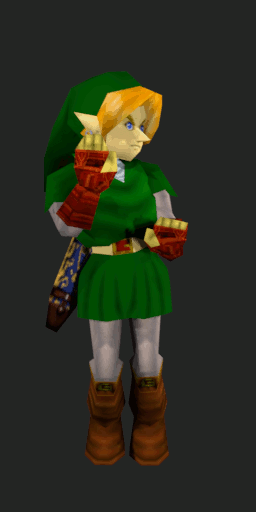

Link IK rig for custom animation import to OoT \
Original rig by rankaisija \
Modifications by Sauraen

Animations created with this rig work correctly in game, including interpolation
from/to existing in-game animations, and animated eye/mouth textures.

### Prerequisites

- Blender 2.8+ (tested with 2.91)
- objex2 (please update regularly)

### If Link's face is magenta:

- Make sure you have the `tex` folder next to the blend file
- Make sure scripts are enabled for the file, see
 https://docs.blender.org/manual/en/latest/advanced/scripting/security.html

### How to create animations

- Animate the IK bones and pole bones. Don't animate the green or red bones
(hidden by default).
- Move the `Eyes` and `Mouth` bones by multiples of 1 on the X axis to change
eyes and mouth textures. If you want "default" (the eye texture determined by
Link's blinking engine), set the eye texture to -1.
- Create one action per in-game animation you want to make. Use the "Force save
data block" option on these actions so they don't get discarded.

### How to export animations

- File > Export > objex2
- Make sure `Link anim BINs` is selected
- The bin files are labeled with their action name and with the number of frames
they last for.
- You will need to make animation headers containing segmented pointers to the
animation data and the frame count. Consult with your romhack lead programmer
for more information.
